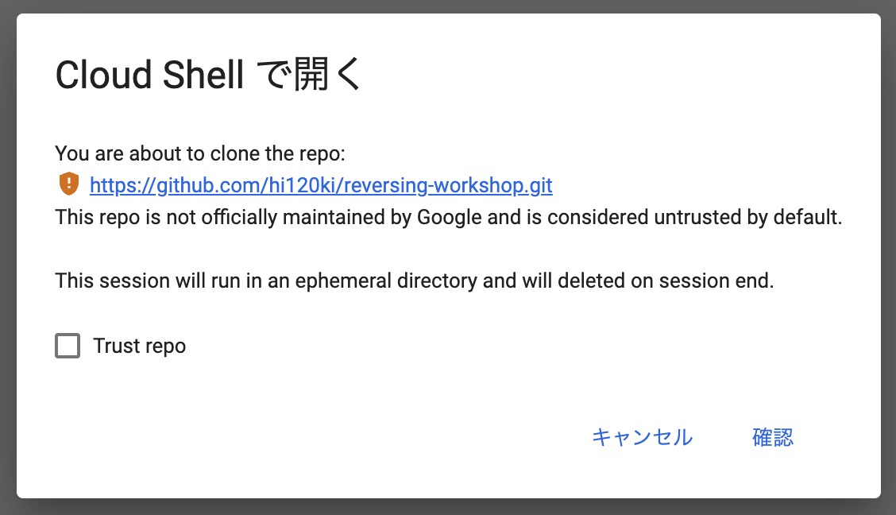
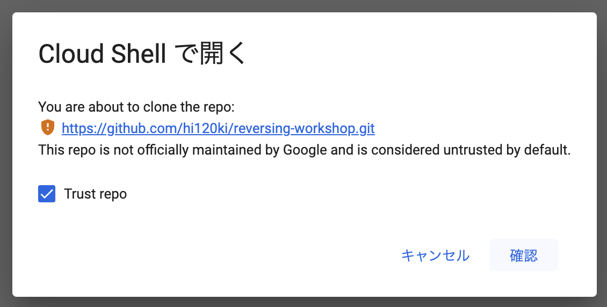

# CTF Reversing ワークショップ

> Google Cloud Shellは基本的に無料で使用できますが、内部の操作でGCPのリソースを扱ったりすると課金が発生することがあるので注意してください。(このワークショップではGCPのリソースは扱いません)
>
> また、[割り当てと上限](https://cloud.google.com/shell/docs/quotas-limits?hl=ja)に記載の仕様や上限(1週間あたり50時間まで等)を確認した上で使用してください。

Google Cloud Shellで開く

ボタンを押すとこのような注意が出ます。

「Trust repo」にチェックを付けて「確認」ボタンをクリックしてください。

